### Procedure
1. Note down the Objectives and Apparatus used. Click on Next to proceed.
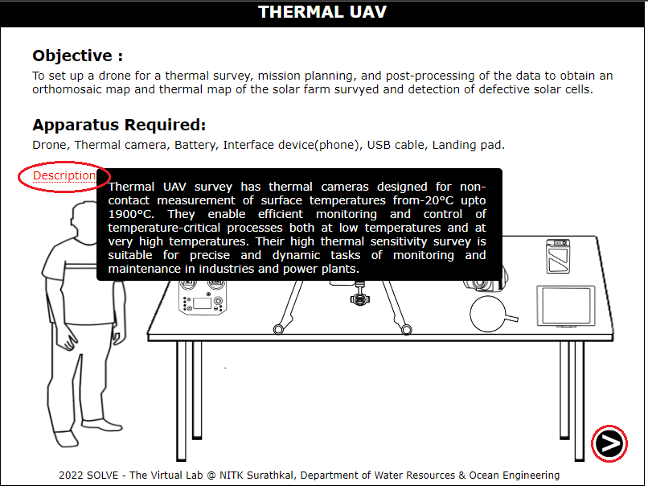 

2. Click on the antennas of the transmitter to unfold them. Click on Next.

   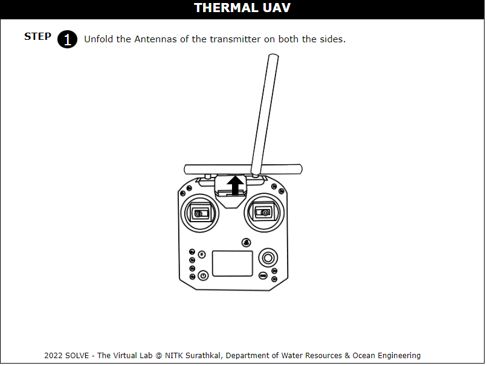  

3. Click on the device to place it on the holder of the transmitter.

    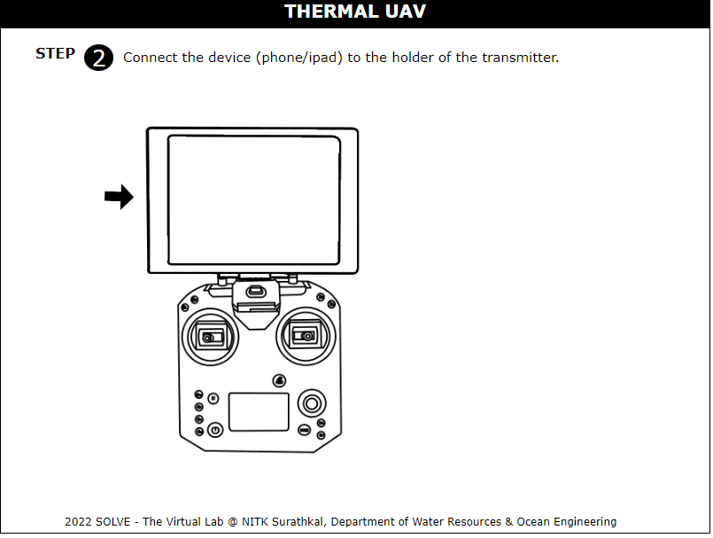  

4. Click on the battery to insert the battery into the transmitter. Click on Next.

    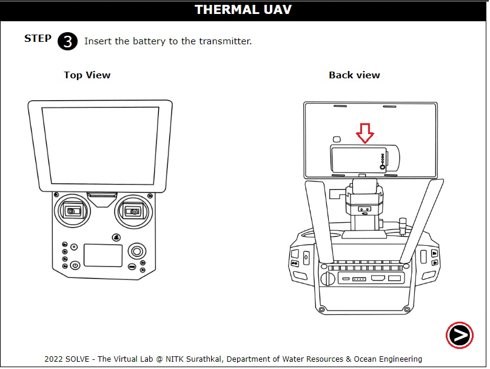 

5. Click on the button to remove the drone from the box

    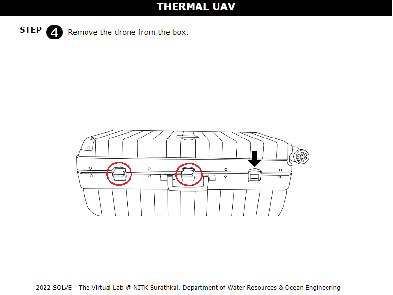

6. Click on the arms to get them to position, click on the arm to lock the arm

    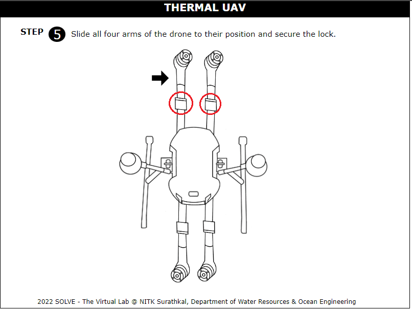    

7. Click on the propeller to fix it to the motor by rotating it. 

    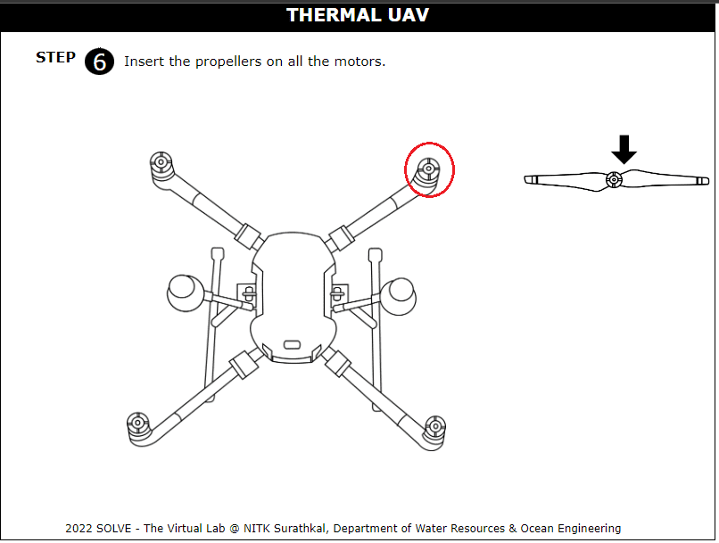   

8. Click on the battery to insert it in the slot in the drone

    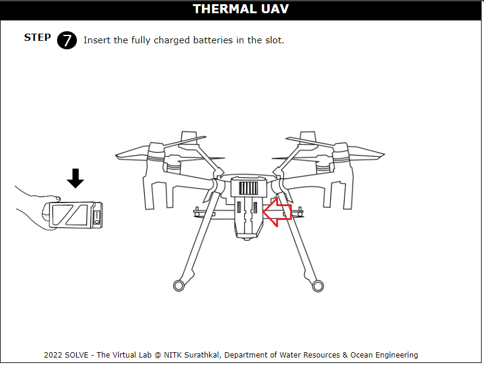  

9.  Click on the landing pad to place the drone before flying.

    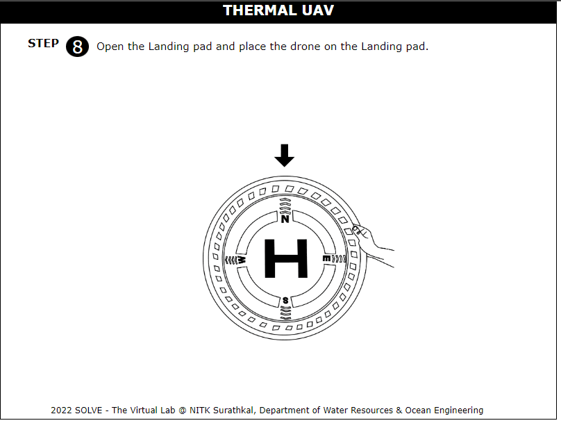  

10. Click on the knob to remove the knob and place the camera in the slot.

    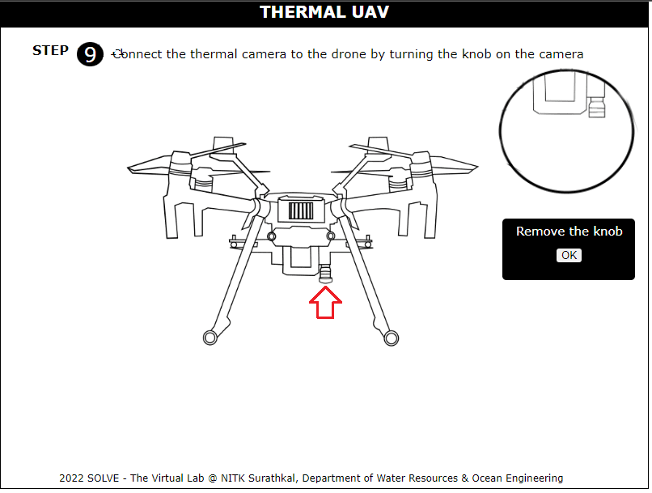  

11. Click on the start button to start the mission planning.

    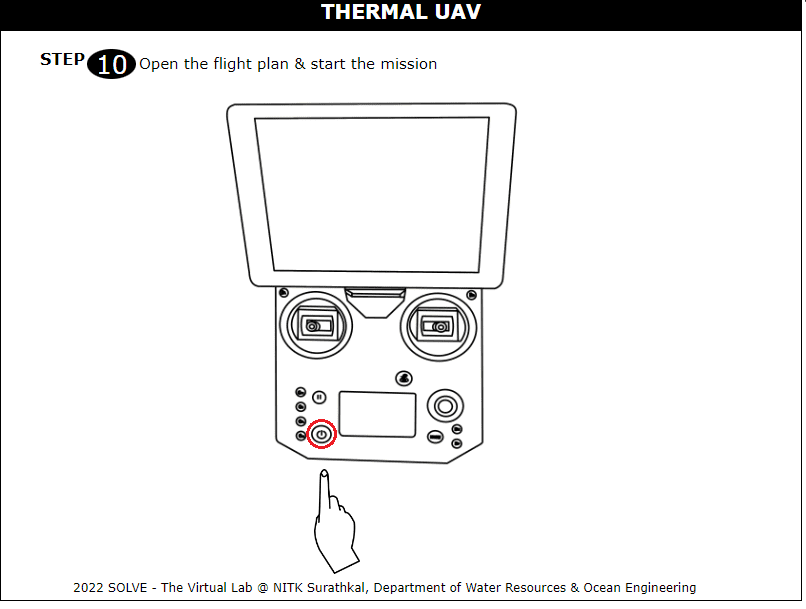

12. Click on the aOpen the Flight planning Mission, Enter the name of the project. Click on Fly and select the flight height from the drop-down menu. Note down the corresponding resolution, and flight time. Click on Show Area to note down the area to be surveyed.

    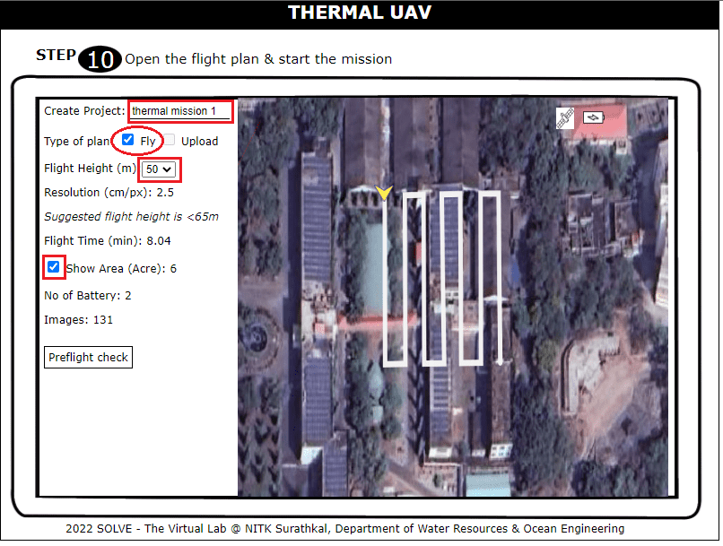 

13.  Note down the Number of Batteries and the number of images to be captured. Click on Preflight Check and tick all the entities. Click on Start mission to fly the drone.
   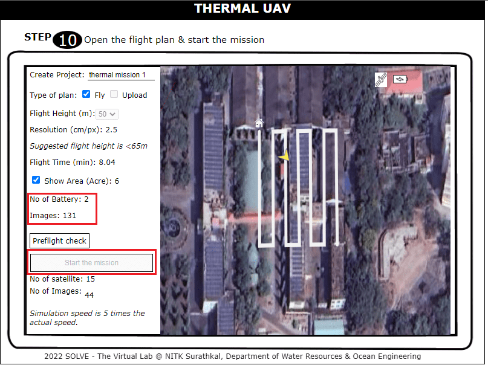 

14. Note the image captures as the drone moves Click on Upload to upload the captured images

    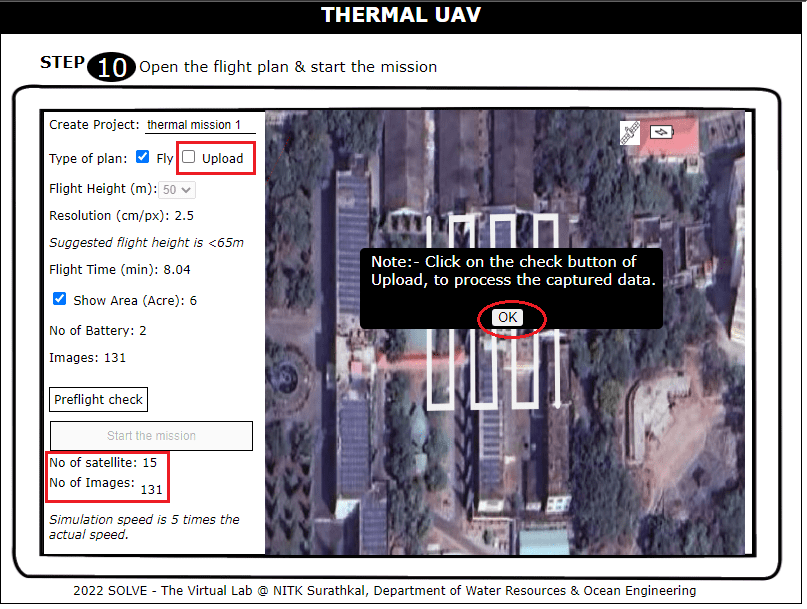  

15. Click on OK to upload the images captured.

    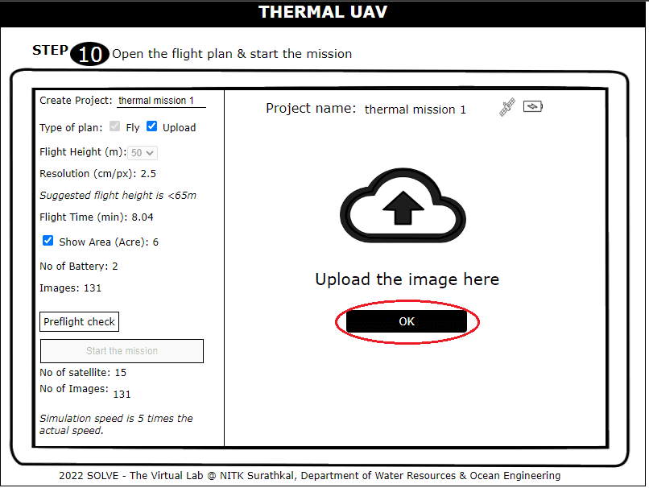      

16. As the upload is complete click on Next to see the processed map.

    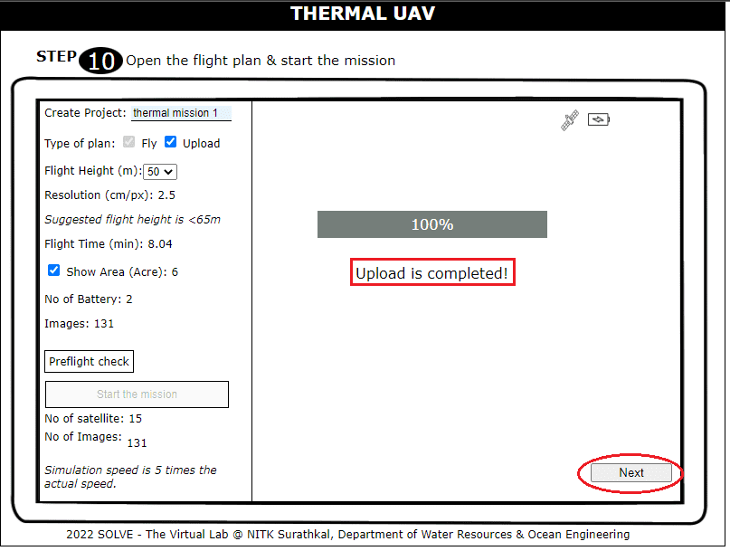 

17. To see the Orthomosaic map, and thermal map click as shown. Click on Next.

    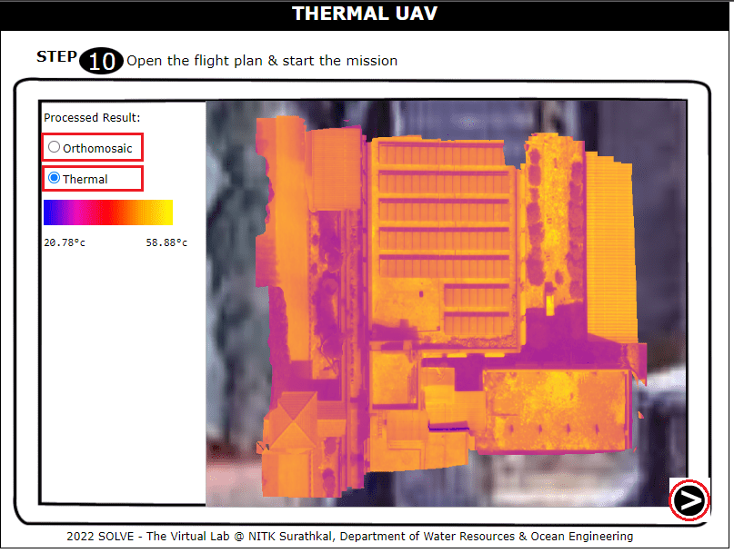

18.  Click on the location shown to see the defective solar cells in the thermal map. Click on next.
   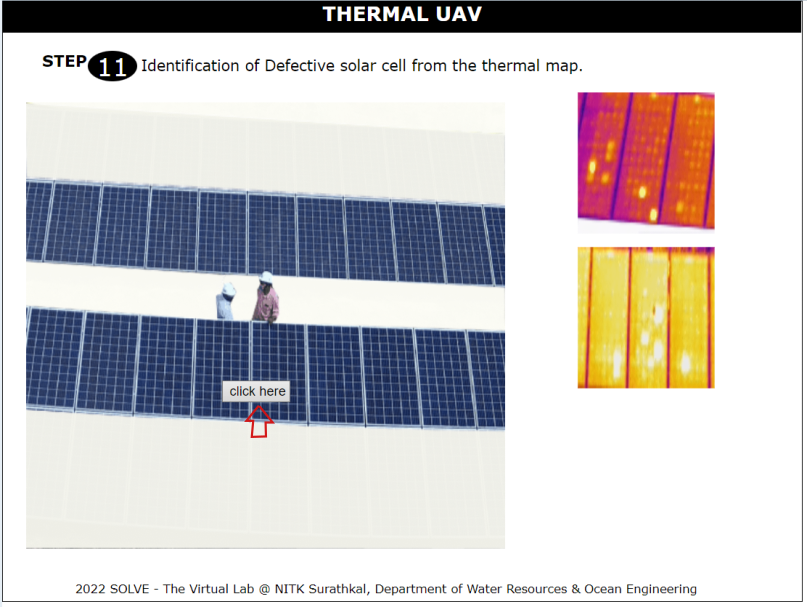 

19. Refer to the observation of the map created.

    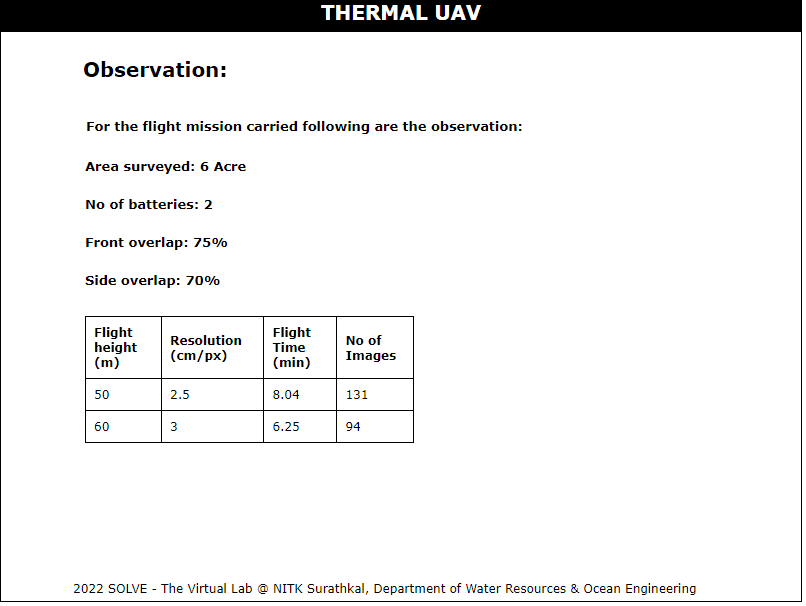  
 
  
 

